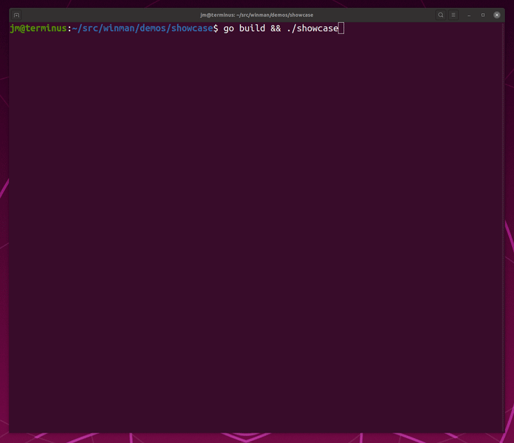
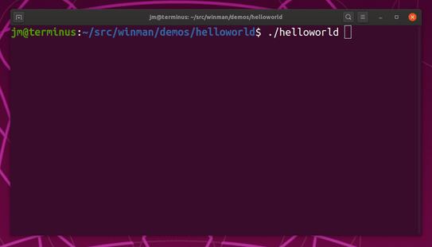

# Winman - go Window Manager for terminal UIs
[](https://travis-ci.org/epiclabs-io/winman)
[](https://goreportcard.com/report/github.com/epiclabs-io/winman)
[](https://pkg.go.dev/github.com/epiclabs-io/winman)

Winman is a basic yet powerful window manager in go for terminal-based user interfaces that plugs into [tview](github.com/rivo/tview).




It supports floating windows that can be dragged, resized and maximized. Windows can have buttons on the title bar, for example to close them, help commands or maximize / minimize.

Windows can also be modal, meaning that other windows don't receive input while
a modal window is on top. You can control whether the user can drag or resize windows around the screen.

Windows can overlap each other by setting their Z-index. Any `tview.Primitive` can be added to a window, thus you can combine with any other existing `tview` widget! Check [tview](github.com/rivo/tview) for a complete list of available widgets you can use.

## Installation

```bash
go get github.com/epiclabs-io/winman
```

## Hello world

```go
package main

import (
	"github.com/epiclabs-io/winman"
	"github.com/rivo/tview"
)

func main() {

	app := tview.NewApplication()
	wm := winman.NewWindowManager()

	content := tview.NewTextView().
		SetText("Hello, world!").       // set content of the text view
		SetTextAlign(tview.AlignCenter) // align text to the center of the text view

	window := wm.NewWindow(). // create new window and add it to the window manager
					Show().                   // make window visible
					SetRoot(content).         // have the text view above be the content of the window
					SetDraggable(true).       // make window draggable around the screen
					SetResizable(true).       // make the window resizable
					SetTitle("Hi!").          // set the window title
					AddButton(&winman.Button{ // create a button with an X to close the application
			Symbol:  'X',
			OnClick: func() { app.Stop() }, // close the application
		})

	window.SetRect(5, 5, 30, 10) // place the window

	// now, execute the application:
	if err := app.SetRoot(wm, true).EnableMouse(true).Run(); err != nil {
		panic(err)
	}
}

```


## Documentation

Refer to https://pkg.go.dev/github.com/epiclabs-io/winman for the package's documentation.
The `demos` directory contains a showcase demonstrating the different aspects of this library

## Dependencies

This package works with [tview](github.com/rivo/tview) and its dependencies.

## Your Feedback

Add your issue here on GitHub. Feel free to get in touch if you have any questions.

## Author(s)

This package is written and maintained by Javier Peletier ([@jpeletier](https://github.com/jpeletier)) - [Epic Labs](https://www.epiclabs.io)